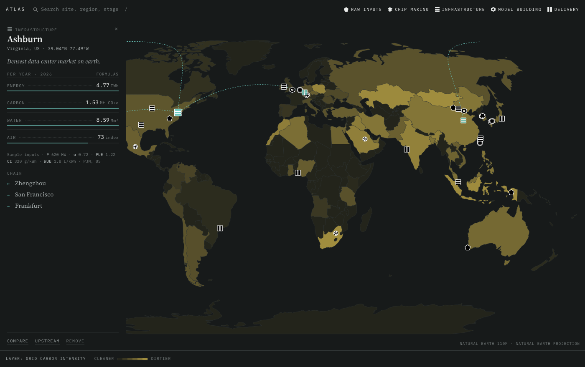

# AI Supply Chain Atlas

A map-first tool for exploring the AI supply chain — from quartz and specialty
gases through fabs, data centers and model training to inference at the edge —
with the environmental load of each node.

**Live:** https://lukeyeh4.github.io/atlas/



---

## What it does

- **32 sites** at real coordinates across five stages: raw inputs, chip making,
  infrastructure, model building, delivery. Each has a facility type (fab,
  mine, training data center, AI lab, …) and takes its inputs from that type
  and its location values from its coordinates.
- **Mapbox globe** with faint terrain relief, flattening to a web map as you
  zoom in; a switch flips between globe and flat.
- **A working model** of each site's yearly load:

  | | |
  |---|---|
  | Energy | `E = P · 8760 · u · PUE`  (MWh/yr) |
  | Carbon | `C = E · CI`  (tCO₂e) |
  | Water | `W = E · process water rate`, or for data centers `P · 8760 · u · WUE`  (m³) |
  | Air | `A = E · fossil share · people within 100 km`  (index, 0–100) |

- **Sourced location data**, looked up most specific first: a 0.25° cell
  (people within 100 km, river-basin water stress) → state or province
  (grid carbon, fossil share, trend, water stress) → country. The panel lists
  every value with where it came from, its confidence and a link to its
  source.
- **Any city.** Search finds real cities (Mapbox geocoding) as well as the
  built-in sites; right-click any land to drop a point, named from reverse
  geocoding. Add a node there by stage and facility type; data center size
  is adjustable.
- **Map layers** — grid carbon intensity, water stress, air quality (PM2.5) —
  painted by country, and by state for the US. Hovering names the place.
- **Globe arcs** show a selected site's supply chain, coloured by what they
  carry (goods or compute and models), with small markers travelling in the
  direction of transfer.
- **Connections** — the whole system as a diagram: stages as columns, five
  kinds of link, chokepoints marked, the parts the map models emphasised.
  Opens on the main chain; hover to trace, click to pin.
- **Scenarios** — fast grid decarbonisation, training moves to the Nordics,
  data center boom — with per-site deltas against baseline, and **Compare
  locations** to see the same node at eleven reference places.
- **Key** — show or hide stages and kinds of connection; folds into one
  button.
- **Search** with `/` or `⌘K`; right-click (or long-press) for context
  actions.

## The data

Location values, facility types and population cells are built from public
sources (Ember, WRI Aqueduct, GHSL, World Bank, operator disclosures and
others) by the scripts in `data/scripts/`; `data/README.md` explains each
file, its sources and its known limits. The app reads three generated files,
whose shape is fixed by [`docs/locale-contract.md`](docs/locale-contract.md):

| File | What |
|---|---|
| `data/locales.json` | Grid, water and air values for 248 countries and 126 states/provinces |
| `data/node-types.json` | Typical inputs for nine facility types |
| `data/cells/` | People within 100 km and basin water stress on a 0.25° grid, in 10° tiles |

Where a value is missing the app falls back to the next level, and offline
it falls back to the inline sample values in `index.html`. Scenario
parameters and some node inputs are still illustrative; the panel marks
each value's confidence.

## Running it

A single HTML file plus its data files. Serve the folder and open it:

```bash
python3 -m http.server 8000
# then visit http://localhost:8000
```

External dependencies: Mapbox GL JS v3 (basemap, terrain, boundaries,
geocoding), d3 v7 and topojson-client (cdnjs / jsDelivr), US state shapes
from us-atlas, and two Google Fonts. It needs a network connection.

The Mapbox public token is set near the top of the map section in
`index.html`. Restrict it to the Pages URL (and `localhost` for development)
in the Mapbox account's token settings.

To rebuild the data: `python3 data/scripts/build_all.py` (see
`data/README.md`).

## Files

| | |
|---|---|
| `index.html` | The whole app — markup, styles, model, map and diagram |
| `data/` | Generated data the app reads, the sources it's built from, and the build scripts |
| `docs/locale-contract.md` | The agreed shape of the data files: the interface between data and app |
| `docs/database.md` | The database plan (Postgres, read-only to the public) |
| `db/schema.sql` | Postgres schema for that database, keyed by ISO code |
| `db/seed-from-index.mjs` | Generates `db/seed.sql` from `index.html` and `data/locales.json` |
| `countries.json` | Natural Earth 110m geometry from v0.3; no longer loaded, kept for reference |
| `CHANGELOG.md` | Every version, with the reasoning |
| `ROADMAP.md` | Blocking questions and planned work |

## Credits

Basemap, terrain, boundaries and geocoding © [Mapbox](https://www.mapbox.com/about/maps/)
© [OpenStreetMap](https://www.openstreetmap.org/copyright) contributors.
US state shapes: [us-atlas](https://github.com/topojson/us-atlas) (US Census
Bureau). Data sources are credited per value in the app and in
`data/README.md`. Typefaces: Source Serif 4 and IBM Plex Mono.
